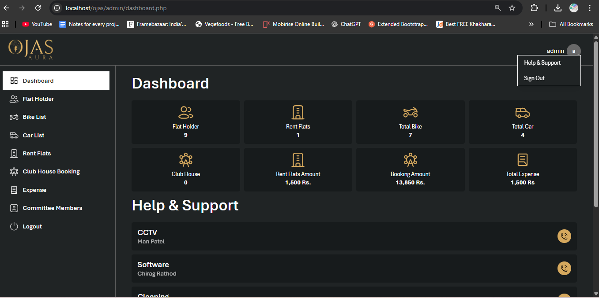
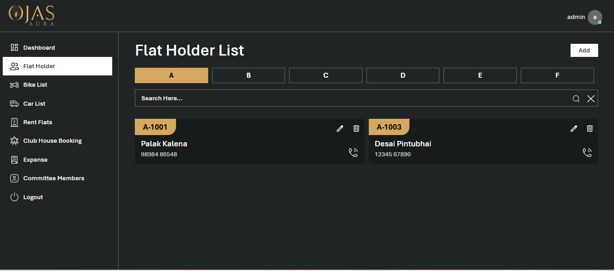
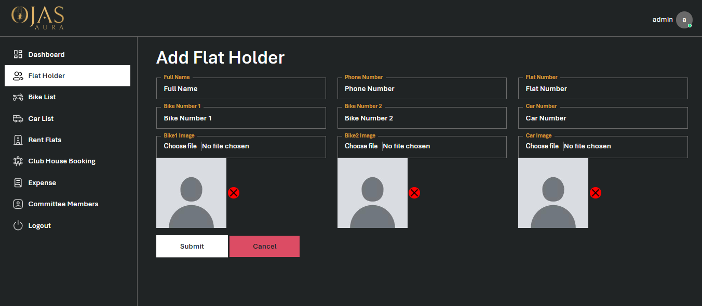

# Ojas Aura – Society Management System

## 📌 Project Overview
Ojas Aura is a PHP-based society management system designed to manage day-to-day residential society operations.
The application provides an admin dashboard to handle flat holders, vehicles, rental flats, clubhouse bookings,
expenses, and committee members through a secure login system.

This project demonstrates authentication, CRUD operations, and a structured admin panel workflow.

---

## 🛠️ Technologies Used
- PHP
- MySQL
- HTML5
- CSS3
- Bootstrap
- JavaScript / jQuery
- XAMPP (Apache & MySQL)

---

## ⚙️ Key Features
- Secure admin login
- Flat Holder management (Add / Edit / Delete / List)
- Bike & Car management
- Rent Flats management
- Club House booking module
- Expense tracking
- Committee members management
- Search and filter functionality
- Clean and responsive admin dashboard UI

---

## 📸 Screenshots

### Login Page


### Dashboard (After Login)


### Flat Holder List


### Add / Edit Flat Holder Form


> Note: Only key screens are documented here to demonstrate the complete CRUD workflow.

---

## 🚀 How to Run This Project Locally

1. Install **XAMPP**
2. Clone the repository:
   ```bash
   https://github.com/Palak12112001/Ojas.git
3.Move the project folder to: 
    xampp/htdocs
4.Start Apache and MySQL
5.Import database from ojas_db.sql file
6.Open browser: 
  http://localhost/ojas/admin/
7.Login with admin credentials

## 📂 Project Folder Structure
/admin
/assets
/screenshots
ojas_db.sql

## 👩‍💻 Developed By

Kalena Palak
Web Developer (PHP)

